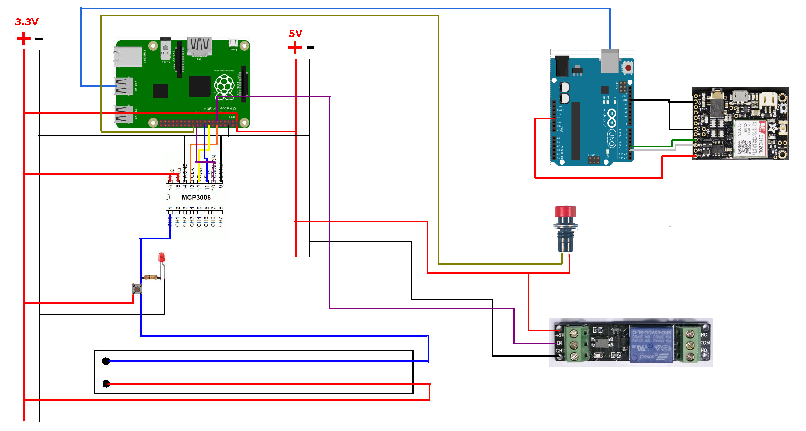

# Oil Detector prototyping

The MCP3008 has its channel 0 to 7 connected.
The relay uses the GPIO pin #00 (relay 1, 2 is unused)
The FONA is connected to the Arduino, conected to the RPi with its serial cable

To run:
Start the node server on the RasPI:
```
Prompt> node server.js
```
(Ctrl+C to stop it)
It runs by default on port 9876

Then run the WebSocket feeder (that also reads the sensor and drives the relay):
```
Prompt> ./run.ws
```
(Ctrl+C to stop it)

All properties are driven by props.properties.
WebSocket URI can be customized with ws.uri=ws://localhost:9876/
Default value is ws://localhost:9876/

From any device connected on the RasPI network, reach 
http://192.168.1.1:9876/data/display.html

The relay will turn off when the value read from the ADC means 'Oil', just before the poil reaches the pump.


